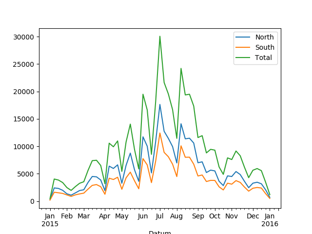

class: middle, center, title-slide

# Tools for Reproducible Science

.footnote[Tim Head, Wild Tree Tech, [RCS 2018](http://rcs18.ethz.ch/)]

---

# Newton's Third Law

.larger[
> The third law states that all forces between two objects exist in equal magnitude and opposite direction: if one object A exerts a force $F_A$ on a second object B, then B simultaneously exerts a force $F_B$ on A, and the two forces are equal in magnitude and opposite in direction.
]

or

---

# Newton's Third Law

.middle.larger[
$$
F_A = -F_B
$$
]

.footnote[From https://en.wikipedia.org/wiki/Newton%27s_laws_of_motion, August 2018]

???

Today experiments can't be described on a static piece of paper anymore. It is like using text to describe Newton's laws instead of using equations. Text takes a lot more space and is less precise than using maths. Today's experiments involve software which is essential to understanding the work that happened. We need to communicate more than just text.

We need a new medium.

paper == static


---

# Is Paper Obsolete?

<video autoplay="autoplay" loop="loop" muted="muted"
      playsinline="playsinline"
      poster="img/SciencePaperFlames-New.jpg"
      style="width:100%; height:100%"
      webkit-playsinline="webkit-playsinline">
  <source src="img/SciencePaperFlames-New.mp4" />
</video>

.footnote[https://www.theatlantic.com/science/archive/2018/04/the-scientific-paper-is-obsolete/556676/]

---

# Going beyond paper

.center.width-90[]

???

With just the static paper it isn't actually well defined what they did. This
means that we can't reproduce their work because we don't actually know
what it is they did.

---

# Going beyond paper

.center.width-90[]

???

We need the code and the environment in which that code was run in order
to have a full definition of what it is they did. Now we can start
discussing about reproducing their work.

---

# Reproduce$^\*$ this

How long would it take you to get this code running?

* 5 days
* 1 day
* 4hours
* never
* no idea

.footnote[$^\*$ Are we replicating or reproducing? Does it matter?]
---
class: middle, center

# Let's do it

<a href="https://mybinder.org/v2/gh/betatim/tbd-nets/binder?filepath=visualize-output.ipynb" class="center width-50"></a>

---

class: middle, center

# That was Binder.

???

This means that producing information is basically free now, but successfully consuming it has never been harder. It is very likely that computer programs played a role in generating that information, so you need to have access to them as well as the text itself

---

class: middle, center

# Today's Talk:
# Running other people's code

---

# Other people's code is ... fun?!

.center.width-70[]

.footnote[From https://xkcd.com/1987/]

---

# The IT Department Approach

Your IT department tightly controls what can be installed, there are
approved tools that you shall use.

.center.width-100[]

???

Conversations go something like:

**A:** Could we upgrade our scikit-learn version? They fixed several bugs that we have been working around for the last 6 months.

**B:** Any new versions need to be audited first.

**A:** Ok, well, I guess we keep working around the issues then ...

---

# The Wild West Approach

Anything goes, all the modern tools, all the time. This is the frontier!

.center.width-100[]

???

You have discussions like:

**A:** I tried to run your script to generate the charts of our monthly sales numbers. It complains about not finding the Shedazzle shell??

**B:** Ah yeah, Shedazzle is the latest in AI powered productivity shell, everyone is using it now, you should also change. Bash really hurts your productivity.

**A:** Ah ok, so ... uhm I guess I'll try installing Shedazzle then ...

**B:** Make sure to install the latest beta, the current release is a bit flakey.

**A:** Ok ... all I wanted to do is make a few charts ...

---

# The Kitchen Sink Approach

.center.width-80[]

.footnote[Credit: ENI Norge]

???

Package up everything together with your code. Libraries, dependencies,
everything. Makes a huge bundle.

Technically speaking this is sending a VM or a container image.

---

# The Ikea Manual Approach

.center.width-90[]

???

Deliver the instructions for assembling the kitchen sink approach.

Technically speaking this is like sending a Dockerfile instead of
the built container image.

---

class: middle, center

# Idea: Dockerfiles for everything.

---

# Easy?

.larger[Crafting a good Dockerfile requires significant expertise.]

These are the six lines you need to install one package:

```
RUN apt-get update && \
    apt-get install --yes --no-install-recommends \
*       less && \
    apt-get purge && \
    apt-get clean && \
    rm -rf /var/lib/apt/lists/*
```

---

# How did that paper do it?

.center.width-100[]

Nothing suspicious to see ...

---

class: middle, center

# repo2docker

---

class: middle, center

# repo2docker builds and runs containers
---

# repo2docker builds and runs containers

Mimics what a human would do:

```
$ git clone https://github.com/davidmascharka/tbd-nets
```
--

Analyse repository:

.center.width-100[]

---

# repo2docker builds and runs containers

Mimics what a human would do:

```
$ git clone https://github.com/davidmascharka/tbd-nets
```

Analyse repository and install dependencies:

```
$ conda install -f environment.yml
```

--

Start Jupyter notebook:

```
$ jupyter notebook
```

---

# repo2docker understands you

It can parse many different files that specify what dependencies to install.
This means that you can keep working the way you have always been working,
and benefit from `repo2docker` from day one.

Supported configuration files:
.larger[
.left-column[
* `requirements.txt`
* `environment.yml`
* `apt.txt`
* `REQUIRE`
* and more!
]
.right-column[
* `install.R`
* `runtime.txt`
* `postBuild`
* `Dockerfile`
]
]

---

# Why is this so great?

When you come back to a project a few months later there is only one command you
need to remember.

Octave (free Matlab clone): https://github.com/binder-examples/octave

---

# Topics

* GitHub and GitLab
* Managing dependencies
* repo2docker and/or mybinder.org
* 🍦 ☕️ ☀️ break 🍦 ☕️ ☀️
* Data storage options and long term code storage
* Notebooks as scripts, papermill
* Keeping it all working

---

# Mini research project

I will use a made up project that analyses bike rides in Zurich.

The goal is to reproduce this figure.

.center.width-60[]

---

# GitHub or GitLab

A place to host your code, its history, project management, and collaboration.

Just use it.

**Exercise:** create an account on github.com

---

# Create a new repository

**Exercise:** create a new repository called "zurich-bikes"

**Exercise:** create a file called `hello.py` via the web interface with `print("Hello world")` on the first line.

---

# Run it!

Head over to https://mybinder.org/

The interface you see on mybinder.org let's you specify the repository you want
to have started.

**Exercise:**

1. Type the URL of your repository into the "GitHub repo or URL" box (should be
    something like https://github.com/YOURGITHUBNAME/zurich-bikes/)
1. As you type the URL the webpage will generate a link you can share with
   others in the "Copy the URL below..." box. It should look something like: https://mybinder.org/v2/gh/YOURGITHUBNAME/zurich-bikes/master
1. Copy it, open a new tab and visit that URL

---

# Add some analysis code


---
